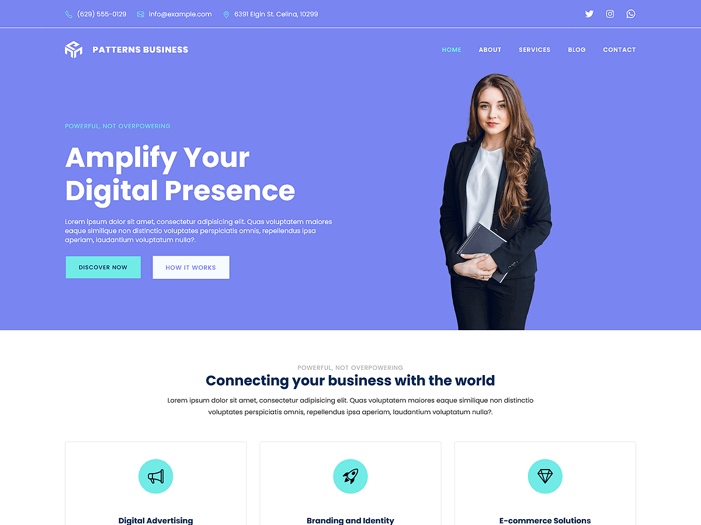

# Patterns Business

Patterns Business is designed for businesses, agencies, and corporate professionals. Built with WordPress Full Site Editing (FSE), this theme enables seamless customization of headers, footers, templates, and global styles directly within the WordPress Site Editor. The theme includes pre-designed patterns specifically crafted to showcase your feature sections, services, team, counter, clients, portfolio, testimonials, about page, service page, contact page, and more. Its responsive design ensures that your website maintains a polished and professional appearance across all devices. Whether you are launching a startup or managing a corporate agency, Patterns Business provides a versatile and impactful platform to establish your online presence and engage your audience effectively.

Primary color: `#7985f0`.



## Features

- 3 hero and landing patterns
- 3 card layouts (card-1 through card-3)
- 1 service section pattern
- 5 archive/post-listing patterns
- Contact page pattern (page-contact)
- 1 menu navigation pattern
- 15 section layout patterns (featured sections and section titles)
- Full Site Editing (FSE) support
- Responsive design
- 65 block patterns + 15 templates + 11 template parts
- Business and corporate oriented layouts (services, team, contact)

## Requirements

- WordPress 6.6 or higher
- PHP 7.0 or higher
- Tested up to WordPress 6.7

## Development

This theme uses `@wordpress/scripts`:

```sh
npm install
npm run start    # dev mode with watch
npm run build    # production build
```

## License

GNU General Public License v2 or later.

This theme is based on [WP Block Theme Boilerplate](https://github.com/codersantosh/wp-block-theme-boilerplate), (C) 2025 Santosh Kunwar, [GPLv2 or later](https://www.gnu.org/licenses/gpl-2.0.html).
